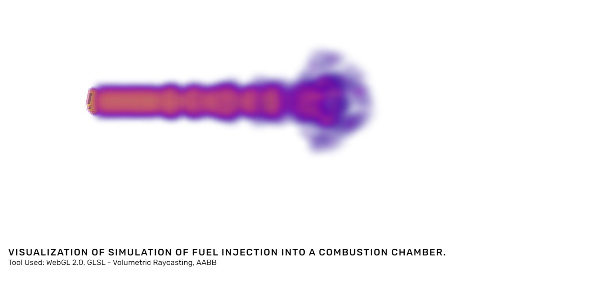

# Graphics_Live_Demo

This is a repo where i push code implementing different ideas and tools to visualize 3D Volume Data.   

## Guidance
<h3>This project is created with the help of <a href="https://stevepetruzza.io/">Prof. Dr. Steve Petruzza</a> and <a href="https://www.willusher.io/">Will Usher</a>.</h3>

## Purpose
This is a repository where i push code to demonstrate different ideas in Scientific Visualisation.
<b> Currently, this repo is hosting the project code of volumetric raycasting.</b>
You can read the article explaning the idea and code in <a href="https://www.icodeeveryday.com/sci-vis-volumetric-raycasting/">icodeeveryday.com</a> 

## Tools
1. API- WebGL 2.O (OPENGL ES 3.O)
2. Shading Language - GLSL ES 3.O
3. Rendering Technique- Volumetric ray casting (Single-Pass)
4. Camera - Perspective Camera
5. Controller - ArcBall (using quaternions)
6. Bounding Box - Axis-Alligned Bounding Box (AABB)

## Note ( for someone  frustated with decoding in GLSL like i was) : 
JS file [webgl_lint.js](https://greggman.github.io/webgl-lint/webgl-lint.js) included in index.html is a library developed by  Gregg Tavares. It is very useful tool for debugging specially for GLSL. 

